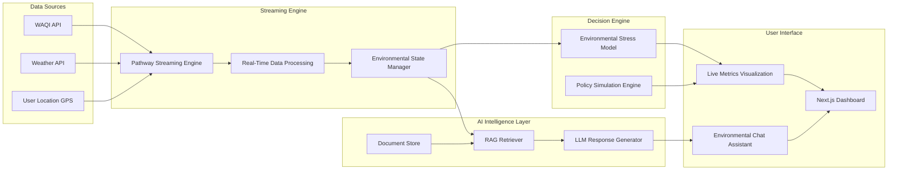

<p align="center">
  
  
  
  
</p>
<p align="center">


</p>

<p align="center">


</p>
<p align="center">
Transforming environmental data into real-time intelligence using  
AI • Streaming Data • RAG • Policy Simulation
</p>

---

# 🚀 Overview

EcoStream AI is a **real-time environmental intelligence platform** that converts live environmental data into **actionable insights**.

Instead of just showing pollution data, EcoStream AI enables:

• real-time environmental monitoring  
• AI-powered environmental Q&A  
• environmental stress prediction  
• policy impact simulation

The platform combines **streaming analytics + AI reasoning + decision simulation** to help understand environmental risks.

---

# 🎯 Problem

Environmental dashboards today show **raw data but no intelligence**.

Problems:

• pollution data is fragmented  
• citizens cannot interpret AQI trends  
• policymakers lack simulation tools  
• environmental decision support is missing

---

# 💡 Solution

EcoStream AI provides:

✔ Real-time environmental monitoring  
✔ AI-powered environmental intelligence engine  
✔ Policy simulation system  
✔ Environmental stress prediction

This transforms environmental data into **decision-making intelligence**.

---

# ⚡ Key Features

### 🌍 Live Environmental Monitoring

• Real-time AQI data streaming  
• Temperature monitoring  
• Environmental stress score calculation  
• Auto refresh every few seconds

---

### 🤖 Environmental Intelligence Engine

AI powered **RAG system** that answers questions like:

• What is the AQI right now?  
• Is pollution dangerous today?  
• What are WHO guidelines?

---

### 🧠 Environmental Stress Score

AI model that converts environmental signals into:
```
Environmental Stress Score = f(AQI, Temperature)
```
Helps quantify environmental risk.

---

### 📊 Policy Simulator

Simulate environmental policies such as:

• traffic reduction  
• emission control  
• pollution mitigation

The system predicts **future environmental impact**.

---

# 🧩 System Architecture


---

# 🧠 AI Components

EcoStream AI integrates multiple AI modules:

### Retrieval Augmented Generation (RAG)

• environmental guidelines  
• WHO pollution thresholds  
• live environmental data

---

### Environmental Risk Model

AI formula used:
```
Stress Score = 0.6 × AQI + 0.4 × Temperature
```

Helps measure environmental impact.

---

# 🛠 Tech Stack

## Frontend


---

## Backend


---

## AI / Streaming

• Pathway Streaming Engine  
• Retrieval Augmented Generation (RAG)  
• Environmental Data APIs  

---


# 📦 Project Structure
```

EcoStream-AI/
│
├── backend/
│   │
│   ├── app.py                 # FastAPI / Flask entry point
│   ├── config.py              # Constants, thresholds, weights
│   │
│   ├── ingestion/
│   │   ├── aqi_stream.py
│   │   ├── weather_stream.py
│   │   └── rss_stream.py
│   │
│   ├── streaming/
│   │   ├── transformations.py   # rolling windows, joins
│   │   ├── risk_engine.py       # stress score logic
│   │   └── alerts.py            # event trigger logic
│   │
│   ├── rag/
│   │   ├── document_store.py
│   │   ├── retriever.py
│   │   └── llm_handler.py
│   │
│   ├── simulator/
│   │   └── policy_simulator.py
│   │
│   └── utils/
│       └── helpers.py
│
├── frontend/
│   │
│   ├── index.html
│   ├── styles.css
│   └── script.js
│
├── docs/
│   └── architecture.png
│
├── requirements.txt
├── README.md
└── .venv

And Many others ..........
```

---

# 🌐 Deployment

EcoStream AI runs as a **cloud-based real-time system**.

Deployment stack:

• Docker containers  
• Render Cloud  
• Streaming backend  

---

# 📊 Live Capabilities

✔ Live AQI updates  
✔ Environmental risk prediction  
✔ AI environmental assistant  
✔ policy simulation engine  

---

# 🔮 Future Improvements

• Multi-city environmental monitoring  
• satellite pollution data integration  
• climate prediction models  
• government decision dashboards  

---

# 👥 Team

### Team Name  
Chole Bhature

### Project  
EcoStream AI

### Team Lead  
Ananya

### Team Members
• Chaithrika Yadav

• Ayush Rajput

• Jatin Gupta

---

# 🌱 Vision

EcoStream AI demonstrates how **AI + streaming analytics** can transform environmental monitoring into **decision intelligence platforms** for smart cities.

---

# ⭐ If you like this project

Give it a ⭐ on GitHub!

<p align="center">
  
</p>
